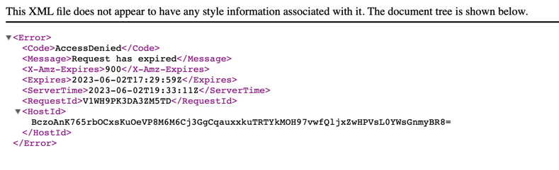

## High-Level Design:

* The Lambda function will be triggered by an event, such as EventBridge Rule.
* The Lambda function will list the objects in the specified S3 bucket and retrieve the metadata for each object.
* It will sort the objects based on the last modified timestamp to identify the latest file.
* The Lambda function will generate a pre-signed URL for the latest file with a 15-minute expiration time.
* The pre-signed URL will be returned as the result.


## Write a time estimation for this task

A rough estimate for this task could be around 3-4 hours.

## How to deploy:

For running this Cloudformation Template by AWS-CLI we need to be sure that we already have configured somewhere AWS-CLI or we can add this now:

```aws configure --profile testuser```

We should add ```aws_access_key_id``` and ```aws_secret_access_key``` and optionally ```default region``` of aws and ``format`` for output (txt or json) and type ENTER

When everything fine and user has enough permittions we should use this command for running that:

```aws cloudformation create-stack --stack-name s3bucketfilesops --template-body file://s3.yaml  --capabilities CAPABILITY_IAM --capabilities CAPABILITY_NAMED_IAM --profile testuser```

We also will be able to run this using AWS CONSOLE - https://docs.aws.amazon.com/AWSCloudFormation/latest/UserGuide/cfn-console-create-stack.html

### This script will add next resorces to AWS:
* s3bucket
* lambda function
* eventbridge rule
* execution role for lambda
* permitions for lambda for rule
* cloudwatch group and streams

In the result we will have automation solution which will compare files (excluded file with name generated-url.json) from s3 bucket and for newest file will generate pre-signed URL which has expiration time 15 minutes. 
Also, we will have cronjob using EventBridgeRule and Cloudwatch log, where we can find an information regarding our status.

## How to test:

* Open the S3 bucket which was made by Cloudformation
* Upload new file
* Open file generated-url.json and copy the url which was added
* Open this pre-signed URL in another tab of your browser and wait 15 minutes.
* Upload new different file and wait at least one minute
* Open file generated-url.json and compare with url which was already opened in another tab
* Open this new pre-signed URL in another tab of your browser and wait 15 minutes.
* Compare uploaded files in 2 cases in right order
* Check first and second tabs for checking expire time. The pages have to be like an example
* 

## Possible improvements that out-scope this task due to time/effort limitation 
* Better to use like an sources for trigers s3EventNotification and in this case we can avoid cronjob with running lambda every one minutes.